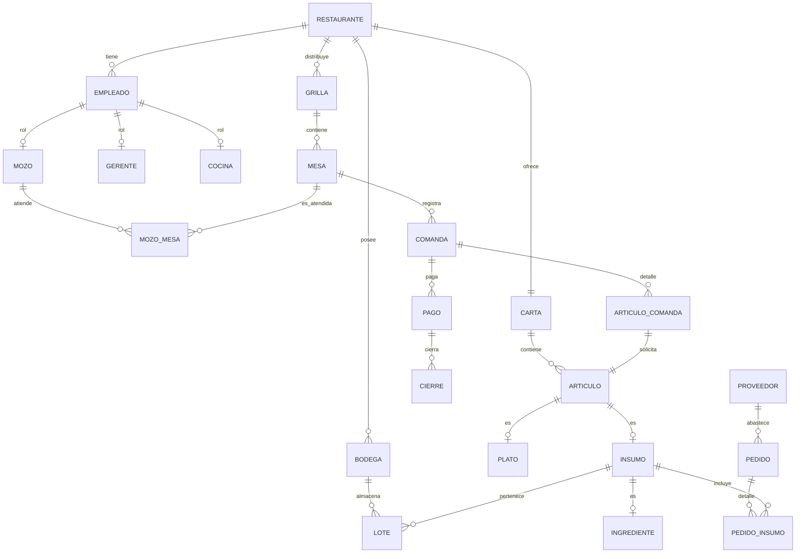

# Modelo de Datos - Pan Comido

Este documento detalla todas las entidades, relaciones y atributos que componen la base de datos de **Pan Comido** (diseñada para PostgreSQL / Supabase). La estructura está dividida en módulos lógicos para facilitar su comprensión.

---

## 1. Diagrama de Relación Simplificado (Entidades Principales)

El siguiente diagrama representa las relaciones clave entre los componentes principales del sistema:



---

## 2. Diccionario de Entidades y Atributos

### 2.1. Entidades Maestras y Paramétricas (Catálogos)

Estas tablas definen valores fijos, configuraciones estéticas y estados del sistema.

#### Tabla: `ubicacion`
Almacena las direcciones físicas de los restaurantes.
| Atributo | Tipo | Restricciones | Descripción |
| :--- | :--- | :--- | :--- |
| `id` | `SERIAL` | PK | Identificador único autoincremental |
| `direccion` | `TEXT` | NOT NULL | Calle, número y departamento |
| `ciudad` | `TEXT` | NOT NULL | Nombre de la ciudad o localidad |
| `codigo_postal` | `TEXT` | NOT NULL | Código postal de la ubicación |

#### Tabla: `estado_mesa`
Estados posibles de una mesa (ej. Libre, Ocupada, Reservada).
| Atributo | Tipo | Restricciones | Descripción |
| :--- | :--- | :--- | :--- |
| `id` | `SERIAL` | PK | Identificador único |
| `descripcion` | `TEXT` | NOT NULL, UNIQUE | Nombre del estado |

#### Tabla: `dimension_mesa`
Define las formas y recursos visuales asociados a la representación de las mesas.
| Atributo | Tipo | Restricciones | Descripción |
| :--- | :--- | :--- | :--- |
| `id` | `SERIAL` | PK | Identificador único |
| `imagen` | `TEXT` | - | Ruta o URL del recurso gráfico de la mesa |
| `forma` | `TEXT` | NOT NULL | Forma geométrica (Rectangular, Redonda, etc.) |

#### Tabla: `categoria_llamado`
Motivo por el cual un cliente o mesa realiza un llamado (ej. Pedir la cuenta, Traer cubiertos).
| Atributo | Tipo | Restricciones | Descripción |
| :--- | :--- | :--- | :--- |
| `id` | `SERIAL` | PK | Identificador único |
| `descripcion` | `TEXT` | NOT NULL, UNIQUE | Descripción del tipo de llamado |

#### Tabla: `estado_comanda`
Estados del ciclo de vida de una mesa o comanda (ej. Abierta, Cerrada, Pagada).
| Atributo | Tipo | Restricciones | Descripción |
| :--- | :--- | :--- | :--- |
| `id` | `SERIAL` | PK | Identificador único |
| `descripcion` | `TEXT` | NOT NULL, UNIQUE | Nombre del estado de la comanda |

#### Tabla: `configuracion_articulo`
Configuraciones extra para artículos del menú.
| Atributo | Tipo | Restricciones | Descripción |
| :--- | :--- | :--- | :--- |
| `id` | `SERIAL` | PK | Identificador único |
| `descripcion` | `TEXT` | NOT NULL, UNIQUE | Configuración específica |

#### Tabla: `categoria_plato`
Categorías gastronómicas de platos (ej. Entrada, Plato Principal, Postre).
| Atributo | Tipo | Restricciones | Descripción |
| :--- | :--- | :--- | :--- |
| `id` | `SERIAL` | PK | Identificador único |
| `descripcion` | `TEXT` | NOT NULL, UNIQUE | Nombre de la categoría |

#### Tabla: `tipo_plato`
Clasificación culinaria (ej. Vegano, Apto Celíacos, Minutas).
| Atributo | Tipo | Restricciones | Descripción |
| :--- | :--- | :--- | :--- |
| `id` | `SERIAL` | PK | Identificador único |
| `descripcion` | `TEXT` | NOT NULL, UNIQUE | Descripción del tipo de plato |

#### Tabla: `restriccion`
Restricciones alimentarias (ej. Celíaco, Vegano, Intolerante a la Lactosa).
| Atributo | Tipo | Restricciones | Descripción |
| :--- | :--- | :--- | :--- |
| `id` | `SERIAL` | PK | Identificador único |
| `descripcion` | `TEXT` | NOT NULL, UNIQUE | Nombre de la restricción |

#### Tabla: `categoria_insumo`
Categorización de ingredientes y bebidas.
| Atributo | Tipo | Restricciones | Descripción |
| :--- | :--- | :--- | :--- |
| `id` | `SERIAL` | PK | Identificador único |
| `descripcion` | `TEXT` | NOT NULL, UNIQUE | Nombre de la categoría |
| `tipo_aplica` | `INTEGER` | NOT NULL | Tipo de insumo (1 = Ingrediente, 2 = Bebida) |

#### Tabla: `unidad_medida`
Unidades para control de inventario (ej. Gramos, Mililitros, Unidades).
| Atributo | Tipo | Restricciones | Descripción |
| :--- | :--- | :--- | :--- |
| `id` | `SERIAL` | PK | Identificador único |
| `nombre` | `TEXT` | NOT NULL, UNIQUE | Nombre de la unidad |

#### Tabla: `tipo_bodega`
Tipos de almacenamiento (ej. Congelados, Secos, Barra).
| Atributo | Tipo | Restricciones | Descripción |
| :--- | :--- | :--- | :--- |
| `id` | `SERIAL` | PK | Identificador único |
| `descripcion` | `TEXT` | NOT NULL, UNIQUE | Tipo de depósito |

#### Tabla: `estado_pedido`
Estados de una orden de compra a proveedores (ej. Pendiente, Recibido, Cancelado).
| Atributo | Tipo | Restricciones | Descripción |
| :--- | :--- | :--- | :--- |
| `id` | `SERIAL` | PK | Identificador único |
| `descripcion` | `TEXT` | NOT NULL, UNIQUE | Nombre del estado del pedido |

#### Tabla: `metodo_de_pago`
Medios de pago soportados (ej. Efectivo, Tarjeta de Débito, Mercado Pago).
| Atributo | Tipo | Restricciones | Descripción |
| :--- | :--- | :--- | :--- |
| `id` | `SERIAL` | PK | Identificador único |
| `descripcion` | `TEXT` | NOT NULL, UNIQUE | Nombre del método de pago |

#### Tabla: `estado_pago`
Estados transaccionales de los cobros (ej. Pendiente, Aprobado, Rechazado).
| Atributo | Tipo | Restricciones | Descripción |
| :--- | :--- | :--- | :--- |
| `id` | `SERIAL` | PK | Identificador único |
| `descripcion` | `TEXT` | NOT NULL, UNIQUE | Nombre del estado del pago |

#### Tabla: `familia_tipografica`
Estilos visuales predefinidos para la personalización de la interfaz del restaurante.
| Atributo | Tipo | Restricciones | Descripción |
| :--- | :--- | :--- | :--- |
| `id` | `SERIAL` | PK | Identificador único |
| `categoria` | `TEXT` | NOT NULL | Categoría estética ('Moderna', 'Clásica', 'Rústica') |
| `tipografia_titulo` | `TEXT` | NOT NULL | Fuente tipográfica para títulos |
| `tipografia_cuerpo` | `TEXT` | NOT NULL | Fuente tipográfica para textos generales |

---

### 2.2. Restaurante y Dependencias Directas

#### Tabla: `restaurante`
Entidad principal del negocio.
| Atributo | Tipo | Restricciones | Descripción |
| :--- | :--- | :--- | :--- |
| `id` | `SERIAL` | PK | Identificador del restaurante |
| `direccion_id` | `INTEGER` | NOT NULL, FK -> `ubicacion` | Dirección del restaurante |
| `familia_tipografica_id`| `INTEGER` | FK -> `familia_tipografica` | Estilo estético de la aplicación del restaurante |
| `nombre` | `TEXT` | NOT NULL | Nombre comercial |
| `imagen` | `TEXT` | - | Logotipo o fachada del local |
| `color_principal` | `TEXT` | - | Código hexadecimal del color primario (UI) |
| `color_secundario` | `TEXT` | - | Código hexadecimal del color secundario (UI) |

#### Tabla: `carta`
Menú digital que ofrece el restaurante.
| Atributo | Tipo | Restricciones | Descripción |
| :--- | :--- | :--- | :--- |
| `id` | `SERIAL` | PK | Identificador de la carta |
| `restaurante_id` | `INTEGER` | NOT NULL, FK -> `restaurante` | Restaurante propietario de la carta |

#### Tabla: `turno_laboral`
Horarios de operación para los empleados del restaurante.
| Atributo | Tipo | Restricciones | Descripción |
| :--- | :--- | :--- | :--- |
| `id` | `SERIAL` | PK | Identificador del turno |
| `restaurante_id` | `INTEGER` | NOT NULL, FK -> `restaurante` | Restaurante donde aplica el turno |
| `horario_laboral_inicio`| `TIME` | NOT NULL | Hora de inicio del turno |
| `horario_laboral_fin` | `TIME` | NOT NULL | Hora de finalización del turno |
| `es_nocturno` | `BOOLEAN` | NOT NULL, DEFAULT `FALSE` | Bandera que define si cruza la medianoche |

#### Tabla: `grilla`
Plano geométrico o mapa físico del salón del restaurante.
| Atributo | Tipo | Restricciones | Descripción |
| :--- | :--- | :--- | :--- |
| `id` | `SERIAL` | PK | Identificador de la grilla |
| `restaurante_id` | `INTEGER` | NOT NULL, FK -> `restaurante` | Restaurante dueño del salón |
| `cant_columnas` | `INTEGER` | NOT NULL | Ancho del plano en cuadrículas |
| `cant_filas` | `INTEGER` | NOT NULL | Alto del plano en cuadrículas |

#### Tabla: `fila_virtual`
Fila de espera remota o virtual para comensales sin reserva.
| Atributo | Tipo | Restricciones | Descripción |
| :--- | :--- | :--- | :--- |
| `id` | `SERIAL` | PK | Identificador de la fila virtual |
| `restaurante_id` | `INTEGER` | NOT NULL, FK -> `restaurante` | Restaurante al que pertenece |
| `habilitada` | `BOOLEAN` | NOT NULL, DEFAULT `TRUE` | Estado de disponibilidad de la fila |

#### Tabla: `bodega`
Depósitos o almacenes de mercadería e insumos dentro del restaurante.
| Atributo | Tipo | Restricciones | Descripción |
| :--- | :--- | :--- | :--- |
| `id` | `SERIAL` | PK | Identificador de la bodega |
| `restaurante_id` | `INTEGER` | NOT NULL, FK -> `restaurante` | Restaurante dueño del almacén |
| `tipo_bodega_id` | `INTEGER` | NOT NULL, FK -> `tipo_bodega` | Tipo de depósito (seco, refrigerado, etc.) |
| `nombre` | `TEXT` | NOT NULL | Nombre descriptivo del almacén |
| `eliminado` | `BOOLEAN` | NOT NULL, DEFAULT `FALSE` | Borrado lógico |

#### Tabla: `proveedor`
Empresas o personas de abastecimiento.
| Atributo | Tipo | Restricciones | Descripción |
| :--- | :--- | :--- | :--- |
| `id` | `SERIAL` | PK | Identificador del proveedor |
| `restaurante_id` | `INTEGER` | NOT NULL, FK -> `restaurante` | Restaurante asociado al proveedor |
| `nombre` | `TEXT` | NOT NULL | Nombre comercial |
| `numero_telefono_wsp`| `TEXT` | - | Teléfono de WhatsApp para pedidos rápidos |
| `eliminado` | `BOOLEAN` | NOT NULL, DEFAULT `FALSE` | Borrado lógico |

#### Tabla: `categoria_insumo_proveedor`
Relación asociativa muchos a muchos (N:N) que determina qué insumos provee cada proveedor.
| Atributo | Tipo | Restricciones | Descripción |
| :--- | :--- | :--- | :--- |
| `categoria_insumo_id`| `INTEGER` | PK, FK -> `categoria_insumo` | ID de la categoría del insumo |
| `proveedor_id` | `INTEGER` | PK, FK -> `proveedor` | ID del proveedor |

#### Tabla: `notificacion`
Historial de alertas y llamados internos generados en el restaurante.
| Atributo | Tipo | Restricciones | Descripción |
| :--- | :--- | :--- | :--- |
| `id` | `SERIAL` | PK | Identificador de la notificación |
| `restaurante_id` | `INTEGER` | NOT NULL, FK -> `restaurante` | Restaurante que genera/recibe la notificación |
| `fecha` | `TIMESTAMP`| NOT NULL, DEFAULT `NOW()` | Fecha y hora de generación |
| `descripcion` | `TEXT` | NOT NULL | Mensaje de la notificación |
| `resuelta` | `BOOLEAN` | NOT NULL, DEFAULT `FALSE` | Define si el empleado ya la atendió |

#### Tabla: `sugerencia_plato_ia`
Recomendaciones y analíticas generadas automáticamente por Inteligencia Artificial.
| Atributo | Tipo | Restricciones | Descripción |
| :--- | :--- | :--- | :--- |
| `id` | `SERIAL` | PK | Identificador único |
| `restaurante_id` | `INTEGER` | NOT NULL, FK -> `restaurante` | Restaurante destino de la sugerencia |
| `json` | `JSONB` | NOT NULL | Payload con platos sugeridos, tendencias y datos |

#### Tabla: `porcentaje_categoria_plato`
Configuración de margen de ganancia porcentual por restaurante y categoría de platos.
| Atributo | Tipo | Restricciones | Descripción |
| :--- | :--- | :--- | :--- |
| `restaurante_id` | `INTEGER` | PK, FK -> `restaurante` | Restaurante |
| `categoria_plato_id` | `INTEGER` | PK, FK -> `categoria_plato` | Categoría del plato |
| `porcentaje` | `DECIMAL` | NOT NULL, DEFAULT 20 | Margen comercial a aplicar |

#### Tabla: `porcentaje_categoria_bebida`
Configuración de margen de ganancia porcentual por restaurante y categoría de bebidas/insumos.
| Atributo | Tipo | Restricciones | Descripción |
| :--- | :--- | :--- | :--- |
| `restaurante_id` | `INTEGER` | PK, FK -> `restaurante` | Restaurante |
| `categoria_insumo_id`| `INTEGER` | PK, FK -> `categoria_insumo` | Categoría del insumo/bebida |
| `porcentaje` | `DECIMAL` | NOT NULL, DEFAULT 20 | Margen comercial a aplicar |

---

### 2.3. Empleados y Roles

#### Tabla: `empleado`
Entidad base para los trabajadores del restaurante.
| Atributo | Tipo | Restricciones | Descripción |
| :--- | :--- | :--- | :--- |
| `id` | `SERIAL` | PK | Identificador del empleado |
| `restaurante_id` | `INTEGER` | NOT NULL, FK -> `restaurante` | Restaurante donde trabaja |
| `nombre` | `TEXT` | NOT NULL | Nombre completo |
| `email` | `TEXT` | NOT NULL | Correo de inicio de sesión |
| `contrasena` | `TEXT` | NOT NULL | Clave hash |
| `estado` | `TEXT` | NOT NULL, DEFAULT 'activo' | Estado laboral (activo, inactivo, licencia) |
| `eliminado` | `BOOLEAN` | NOT NULL, DEFAULT `FALSE` | Borrado lógico |

#### Tabla: `gerente`
Subtipo de `empleado` encargado del control administrativo.
| Atributo | Tipo | Restricciones | Descripción |
| :--- | :--- | :--- | :--- |
| `id_empleado` | `INTEGER` | PK, FK -> `empleado` | Identificador heredado del empleado |

#### Tabla: `cocina`
Subtipo de `empleado` encargado de la preparación física de los platos.
| Atributo | Tipo | Restricciones | Descripción |
| :--- | :--- | :--- | :--- |
| `id_empleado` | `INTEGER` | PK, FK -> `empleado` | Identificador heredado del empleado |

#### Tabla: `mozo`
Subtipo de `empleado` encargado de la atención de salón.
| Atributo | Tipo | Restricciones | Descripción |
| :--- | :--- | :--- | :--- |
| `id_empleado` | `INTEGER` | PK, FK -> `empleado` | Identificador heredado del empleado |
| `activo` | `BOOLEAN` | NOT NULL, DEFAULT `TRUE` | Disponibilidad actual para tomar mesas |

#### Tabla: `empleado_turno_laboral`
Relación muchos a muchos (N:N) entre empleados y sus turnos.
| Atributo | Tipo | Restricciones | Descripción |
| :--- | :--- | :--- | :--- |
| `empleado_id` | `INTEGER` | PK, FK -> `empleado` | ID del empleado |
| `turno_laboral_id` | `INTEGER` | PK, FK -> `turno_laboral` | ID del turno asignado |

---

### 2.4. Salón, Mesas y Reservas

#### Tabla: `mesa`
Ubicación física en la grilla espacial del salón.
| Atributo | Tipo | Restricciones | Descripción |
| :--- | :--- | :--- | :--- |
| `id` | `SERIAL` | PK | Identificador de la mesa |
| `grilla_id` | `INTEGER` | NOT NULL, FK -> `grilla` | Grilla de distribución a la que pertenece |
| `estado_mesa_id` | `INTEGER` | NOT NULL, FK -> `estado_mesa` | Estado actual de ocupación |
| `dimension_mesa_id` | `INTEGER` | NOT NULL, FK -> `dimension_mesa` | Forma geométrica e imagen asociada |
| `posicion_x_inicio` | `INTEGER` | NOT NULL | Columna inicial de la mesa en el salón |
| `posicion_x_fin` | `INTEGER` | NOT NULL | Columna final de la mesa en el salón |
| `posicion_y_inicio` | `INTEGER` | NOT NULL | Fila inicial de la mesa en el salón |
| `posicion_y_fin` | `INTEGER` | NOT NULL | Fila final de la mesa en el salón |
| `numero` | `INTEGER` | NOT NULL | Número visible de la mesa |
| `activo` | `BOOLEAN` | NOT NULL, DEFAULT `TRUE` | Mesa habilitada o deshabilitada temporalmente |
| `codigo_invitacion` | `TEXT` | - | Código para que los comensales accedan al pedido |
| `cant_personas_max` | `INTEGER` | NOT NULL | Capacidad límite de comensales sentados |
| `tipo_elemento` | `INTEGER` | NOT NULL, DEFAULT 1 | Identificador del tipo de objeto físico (Mesa, Barra, etc.) |
| `color` | `TEXT` | - | Color para dibujo en plano 2D |
| `texto_objeto` | `TEXT` | - | Leyenda o etiqueta adicional de la mesa |

#### Tabla: `mozo_mesa`
Relación asociativa muchos a muchos (N:N) que indica qué mozos atienden qué mesas en el turno actual.
| Atributo | Tipo | Restricciones | Descripción |
| :--- | :--- | :--- | :--- |
| `mozo_id` | `INTEGER` | PK, FK -> `mozo` | Mozo asignado |
| `mesa_id` | `INTEGER` | PK, FK -> `mesa` | Mesa asignada |

#### Tabla: `reserva`
Planificación de ocupación de mesas por parte de comensales.
| Atributo | Tipo | Restricciones | Descripción |
| :--- | :--- | :--- | :--- |
| `id` | `SERIAL` | PK | Identificador de la reserva |
| `mesa_id` | `INTEGER` | NOT NULL, FK -> `mesa` | Mesa comprometida |
| `cant_comensales` | `INTEGER` | NOT NULL | Cantidad de personas esperadas |
| `nombre_titular` | `TEXT` | NOT NULL | Nombre del cliente |
| `fecha` | `DATE` | NOT NULL | Fecha de la reserva |
| `horario` | `TIME` | NOT NULL | Hora reservada |
| `tel_contacto` | `TEXT` | - | Teléfono de contacto |

---

### 2.5. Llamados y Fila Virtual

#### Tabla: `llamado`
Acciones de atención inmediata iniciadas por clientes desde la mesa o por cocina/caja.
| Atributo | Tipo | Restricciones | Descripción |
| :--- | :--- | :--- | :--- |
| `id` | `SERIAL` | PK | Identificador único del llamado |
| `mozo_id` | `INTEGER` | FK -> `mozo` (Nullable) | Mozo que atiende el llamado |
| `gerente_id` | `INTEGER` | FK -> `gerente` (Nullable)| Gerente asignado en caso de escalar |
| `mesa_id` | `INTEGER` | FK -> `mesa` (Nullable) | Mesa origen del llamado |
| `categoria_llamado_id`| `INTEGER` | NOT NULL, FK -> `categoria_llamado` | Categoría o tipo de llamado |
| `descripcion` | `TEXT` | - | Comentarios adicionales |
| `resuelto` | `BOOLEAN` | NOT NULL, DEFAULT `FALSE` | Definición de atención completada |

#### Tabla: `turno_fila`
Turnos numerados dentro de la fila de espera digital.
| Atributo | Tipo | Restricciones | Descripción |
| :--- | :--- | :--- | :--- |
| `id` | `SERIAL` | PK | Identificador único del turno de espera |
| `fila_virtual_id` | `INTEGER` | NOT NULL, FK -> `fila_virtual` | Fila virtual a la que pertenece |
| `numero` | `INTEGER` | NOT NULL | Número de turno para control de orden |

---

### 2.6. Catálogo de Artículos y Platos (Menú)

El menú se construye a través de una jerarquía de herencia con la tabla base `articulo`.

```
        [articulo]
        /        \
    [plato]    [insumo]
                  |
             [ingrediente]
                  |
         [ingrediente_preparado]
```

#### Tabla: `articulo`
Entidad base para cualquier ítem consumible o comercializable.
| Atributo | Tipo | Restricciones | Descripción |
| :--- | :--- | :--- | :--- |
| `id` | `SERIAL` | PK | Identificador del artículo |
| `carta_id` | `INTEGER` | FK -> `carta` (Nullable) | Carta menú en la que figura |
| `restaurante_id` | `INTEGER` | NOT NULL, FK -> `restaurante` | Restaurante propietario |
| `nombre` | `TEXT` | NOT NULL | Nombre comercial |
| `descripcion` | `TEXT` | - | Detalle gastronómico o ingredientes generales |
| `precio_venta_final` | `DECIMAL` | - | Precio base de venta al público |
| `precio_ganancia` | `DECIMAL` | - | Ganancia neta calculada sobre costo |
| `precio_promocional` | `DECIMAL` | - | Precio de oferta (si aplica) |
| `url_imagen` | `TEXT` | - | URL de la imagen del producto |
| `eliminado` | `BOOLEAN` | NOT NULL, DEFAULT `FALSE` | Borrado lógico |

#### Tabla: `articulo_configuracion_articulo`
Configuraciones asociadas a cada artículo (N:N).
| Atributo | Tipo | Restricciones | Descripción |
| :--- | :--- | :--- | :--- |
| `articulo_id` | `INTEGER` | PK, FK -> `articulo` | ID del artículo |
| `configuracion_articulo_id`| `INTEGER`| PK, FK -> `configuracion_articulo`| ID de la configuración |

#### Tabla: `plato`
Especialización de `articulo`. Representa comidas elaboradas en la cocina.
| Atributo | Tipo | Restricciones | Descripción |
| :--- | :--- | :--- | :--- |
| `id_articulo` | `INTEGER` | PK, FK -> `articulo` | Identificador (Heredado de `articulo`) |
| `tipo_plato_id` | `INTEGER` | NOT NULL, FK -> `tipo_plato` | Categorización culinaria |
| `categoria_plato_id` | `INTEGER` | NOT NULL, FK -> `categoria_plato` | Categoría en la carta (Entrada, Principal) |
| `tiempo_preparacion_base`| `INTEGER`| NOT NULL | Minutos aproximados de demora en cocina |
| `destacado` | `BOOLEAN` | NOT NULL, DEFAULT `FALSE` | Bandera para promocionar en el inicio de la app |
| `sugerencia` | `BOOLEAN` | NOT NULL, DEFAULT `FALSE` | Recomendación del chef |

#### Tabla: `insumo`
Especialización de `articulo`. Productos que entran al inventario (bebidas listas para la venta o materias primas).
| Atributo | Tipo | Restricciones | Descripción |
| :--- | :--- | :--- | :--- |
| `id_articulo` | `INTEGER` | PK, FK -> `articulo` | Identificador (Heredado de `articulo`) |
| `categoria_insumo_id`| `INTEGER` | NOT NULL, FK -> `categoria_insumo` | Grupo al que pertenece el insumo |
| `unidad_medida_id` | `INTEGER` | NOT NULL, FK -> `unidad_medida` | Unidad de control (gr, ml, u) |
| `stock_minimo` | `DECIMAL` | NOT NULL, DEFAULT 0 | Umbral de alerta para reposición de stock |

#### Tabla: `ingrediente`
Especialización de `insumo`. Aquellas materias primas destinadas exclusivamente a integrar un plato.
| Atributo | Tipo | Restricciones | Descripción |
| :--- | :--- | :--- | :--- |
| `id_insumo` | `INTEGER` | PK, FK -> `insumo` | Identificador (Heredado de `insumo`) |

#### Tabla: `ingrediente_preparado`
Subtipo de `ingrediente`. Insumos procesados previamente en cocina (ej. Salsas, masas).
| Atributo | Tipo | Restricciones | Descripción |
| :--- | :--- | :--- | :--- |
| `id_ingrediente` | `INTEGER` | PK, FK -> `ingrediente` | Identificador (Heredado de `ingrediente`) |

#### Tabla: `ingrediente_ingrediente_preparado`
Relación recursiva muchos a muchos (N:N) para recetas compuestas por otros ingredientes intermedios.
| Atributo | Tipo | Restricciones | Descripción |
| :--- | :--- | :--- | :--- |
| `ingrediente_id` | `INTEGER` | PK, FK -> `ingrediente` | Ingrediente base / componente |
| `ingrediente_preparado_id`| `INTEGER`| PK, FK -> `ingrediente_preparado`| El ingrediente compuesto resultante |
| `cantidad` | `DECIMAL` | NOT NULL | Cantidad del componente utilizada |

#### Tabla: `restriccion_plato`
Relación muchos a muchos (N:N) que marca qué restricciones alimentarias tiene un plato específico.
| Atributo | Tipo | Restricciones | Descripción |
| :--- | :--- | :--- | :--- |
| `restriccion_id` | `INTEGER` | PK, FK -> `restriccion` | Restricción alimenticia |
| `plato_id` | `INTEGER` | PK, FK -> `plato` | Plato asociado |

#### Tabla: `plato_ingrediente`
Receta o composición del plato. Especifica qué materias primas requiere.
| Atributo | Tipo | Restricciones | Descripción |
| :--- | :--- | :--- | :--- |
| `plato_id` | `INTEGER` | PK, FK -> `plato` | Plato elaborado |
| `ingrediente_id` | `INTEGER` | PK, FK -> `ingrediente` | Ingrediente necesario |
| `opcional` | `BOOLEAN` | NOT NULL, DEFAULT `FALSE` | Si el cliente puede removerlo del pedido |
| `cantidad` | `DECIMAL` | NOT NULL | Cantidad de ingrediente requerida |

---

### 2.7. Control de Inventario y Lotes

#### Tabla: `lote`
Unidades físicas de insumos ingresadas al stock. Permite control FIFO / LIFO y fechas de vencimiento.
| Atributo | Tipo | Restricciones | Descripción |
| :--- | :--- | :--- | :--- |
| `id` | `SERIAL` | PK | Identificador del lote |
| `insumo_id` | `INTEGER` | NOT NULL, FK -> `insumo` | Insumo almacenado |
| `bodega_id` | `INTEGER` | NOT NULL, FK -> `bodega` | Almacén físico donde se encuentra |
| `nombre` | `TEXT` | NOT NULL | Nombre o número identificatorio del lote |
| `cantidad` | `DECIMAL` | NOT NULL | Stock inicial/actual del lote |
| `fecha_adquisicion` | `DATE` | NOT NULL | Fecha de ingreso al inventario |
| `fecha_vencimiento` | `DATE` | - | Fecha de caducidad (Nullable) |

---

### 2.8. Ventas, Comandas y Pagos

#### Tabla: `comanda`
Transacción u orden general de una mesa en una visita.
| Atributo | Tipo | Restricciones | Descripción |
| :--- | :--- | :--- | :--- |
| `id` | `SERIAL` | PK | Identificador de la comanda |
| `mesa_id` | `INTEGER` | NOT NULL, FK -> `mesa` | Mesa vinculada a la orden |
| `restaurante_id` | `INTEGER` | NOT NULL, FK -> `restaurante` | Restaurante donde se emite |
| `estado_comanda_id` | `INTEGER` | NOT NULL, FK -> `estado_comanda` | Estado del servicio (Abierta, Cerrada, etc.) |
| `cant_comensales` | `INTEGER` | NOT NULL | Cantidad de comensales sentados |
| `hora_inicio` | `TIMESTAMP`| NOT NULL, DEFAULT `NOW()` | Fecha/Hora de apertura de la mesa |
| `hora_fin` | `TIMESTAMP`| - | Fecha/Hora de salida y cierre |
| `hora_ultimo_cambio_estado`| `TIMESTAMP`| NOT NULL, DEFAULT `NOW()`| Última modificación de estado de la mesa |

#### Tabla: `articulo_comanda`
Detalle de pedidos realizados dentro de una comanda (ítem por ítem).
| Atributo | Tipo | Restricciones | Descripción |
| :--- | :--- | :--- | :--- |
| `id` | `SERIAL` | PK | Identificador del detalle |
| `comanda_id` | `INTEGER` | NOT NULL, FK -> `comanda` | Comanda de pertenencia |
| `articulo_id` | `INTEGER` | NOT NULL, FK -> `articulo` | Artículo comercializado |
| `cantidad` | `INTEGER` | NOT NULL, DEFAULT 1 | Cantidad solicitada |
| `entregado` | `BOOLEAN` | NOT NULL, DEFAULT `FALSE` | Estado de entrega por parte del mozo/cocina |
| `observaciones_generales`| `TEXT` | - | Aclaraciones del pedido (ej: cocción de la carne) |
| `nombre_comensal` | `TEXT` | NOT NULL, DEFAULT 'Anónimo' | Nombre del cliente que pidió para dividir cuenta |

#### Tabla: `articulo_comanda_ingrediente_excluido`
Especifica ingredientes removidos del plato por preferencia del cliente (ej. Hamburguesa sin cebolla).
| Atributo | Tipo | Restricciones | Descripción |
| :--- | :--- | :--- | :--- |
| `id` | `SERIAL` | PK | Identificador del registro |
| `articulo_comanda_id`| `INTEGER` | NOT NULL, FK -> `articulo_comanda`| Línea del pedido |
| `ingrediente_id` | `INTEGER` | NOT NULL, FK -> `ingrediente` | Ingrediente a excluir en la preparación |
| *Constraint* | `UNIQUE` | `(articulo_comanda_id, ingrediente_id)` | Impide excluir dos veces la misma materia prima |

#### Tabla: `metodo_de_pago_restaurante`
Configuración de métodos de pago activos en cada sucursal.
| Atributo | Tipo | Restricciones | Descripción |
| :--- | :--- | :--- | :--- |
| `restaurante_id` | `INTEGER` | PK, FK -> `restaurante` | Restaurante |
| `metodo_de_pago_id` | `INTEGER` | PK, FK -> `metodo_de_pago` | Medio de pago |
| `habilitado` | `BOOLEAN` | NOT NULL, DEFAULT `TRUE` | Estado de habilitación local |

#### Tabla: `cierre`
Arqueo de caja y cierre de caja al finalizar el turno laboral.
| Atributo | Tipo | Restricciones | Descripción |
| :--- | :--- | :--- | :--- |
| `id` | `SERIAL` | PK | Identificador del arqueo |
| `restaurante_id` | `INTEGER` | NOT NULL, FK -> `restaurante` | Sucursal del arqueo |
| `turno_laboral_id` | `INTEGER` | NOT NULL, FK -> `turno_laboral` | Turno cerrado |
| `diferencia` | `DECIMAL` | NOT NULL, DEFAULT 0 | Descuadre de caja (faltante) |
| `sobrante` | `DECIMAL` | NOT NULL, DEFAULT 0 | Dinero excedente |
| `total_efectivo` | `DECIMAL` | NOT NULL, DEFAULT 0 | Total cobrado en efectivo |
| `total_tarjeta` | `DECIMAL` | NOT NULL, DEFAULT 0 | Total cobrado en plásticos |
| `total_transferencia` | `DECIMAL` | NOT NULL, DEFAULT 0 | Total cobrado en transferencias bancarias |
| `total_mercado_pago` | `DECIMAL` | NOT NULL, DEFAULT 0 | Total cobrado mediante pasarela MercadoPago |

#### Tabla: `pago`
Transacciones financieras individuales para saldar una comanda (admite pagos parciales o divididos).
| Atributo | Tipo | Restricciones | Descripción |
| :--- | :--- | :--- | :--- |
| `id` | `SERIAL` | PK | Identificador del pago |
| `comanda_id` | `INTEGER` | NOT NULL, FK -> `comanda` | Comanda saldada |
| `cierre_id` | `INTEGER` | FK -> `cierre` (Nullable) | Arqueo en el que ingresa el cobro |
| `metodo_pago_id` | `INTEGER` | NOT NULL, FK -> `metodo_de_pago`| Medio financiero utilizado |
| `estado_pago_id` | `INTEGER` | NOT NULL, FK -> `estado_pago` | Situación transaccional |
| `external_reference` | `TEXT` | - | Código de transacción externo (ej: ID MercadoPago) |
| `total` | `DECIMAL` | NOT NULL | Monto abonado |

---

### 2.9. Abastecimiento y Órdenes a Proveedores

#### Tabla: `pedido`
Orden de compra generada hacia un proveedor para reabastecer insumos.
| Atributo | Tipo | Restricciones | Descripción |
| :--- | :--- | :--- | :--- |
| `id` | `SERIAL` | PK | Identificador del pedido |
| `proveedor_id` | `INTEGER` | NOT NULL, FK -> `proveedor` | Destinatario del pedido |
| `estado_pedido_id` | `INTEGER` | NOT NULL, FK -> `estado_pedido` | Estado de la orden |
| `fecha` | `DATE` | NOT NULL, DEFAULT `CURRENT_DATE`| Fecha de emisión de la orden |

#### Tabla: `pedido_insumo`
Líneas de detalle de la orden de compra a proveedores.
| Atributo | Tipo | Restricciones | Descripción |
| :--- | :--- | :--- | :--- |
| `pedido_id` | `INTEGER` | PK, FK -> `pedido` | Orden de compra |
| `insumo_id` | `INTEGER` | PK, FK -> `insumo` | Insumo comprado |
| `precio_compra` | `DECIMAL` | NOT NULL | Costo unitario acordado con el proveedor |
| `cantidad` | `DECIMAL` | NOT NULL | Cantidad de unidades a adquirir |

---

## 3. Resumen de Claves Foráneas (Relaciones)

Las claves foráneas del sistema garantizan la integridad referencial de los datos. A continuación se listan las principales políticas y vínculos:

1. **Jerarquías de Herencia (1:1)**:
   - `gerente`, `cocina` y `mozo` heredan la PK (`id_empleado`) referenciando a `empleado(id)`.
   - `plato` e `insumo` heredan la PK (`id_articulo`) de `articulo(id)`.
   - `ingrediente` hereda la PK (`id_insumo`) de `insumo(id_articulo)`.
   - `ingrediente_preparado` hereda la PK (`id_ingrediente`) de `ingrediente(id_insumo)`.

2. **Tablas Intermedias Muchos a Muchos (N:N)**:
   - `categoria_insumo_proveedor` (`categoria_insumo_id` $\rightarrow$ `categoria_insumo`, `proveedor_id` $\rightarrow$ `proveedor`).
   - `empleado_turno_laboral` (`empleado_id` $\rightarrow$ `empleado`, `turno_laboral_id` $\rightarrow$ `turno_laboral`).
   - `mozo_mesa` (`mozo_id` $\rightarrow$ `mozo`, `mesa_id` $\rightarrow$ `mesa`).
   - `articulo_configuracion_articulo` (`articulo_id` $\rightarrow$ `articulo`, `configuracion_articulo_id` $\rightarrow$ `configuracion_articulo`).
   - `ingrediente_ingrediente_preparado` (`ingrediente_id` $\rightarrow$ `ingrediente`, `ingrediente_preparado_id` $\rightarrow$ `ingrediente_preparado`).
   - `restriccion_plato` (`restriccion_id` $\rightarrow$ `restriccion`, `plato_id` $\rightarrow$ `plato`).
   - `plato_ingrediente` (`plato_id` $\rightarrow$ `plato`, `ingrediente_id` $\rightarrow$ `ingrediente`).
   - `metodo_de_pago_restaurante` (`restaurante_id` $\rightarrow$ `restaurante`, `metodo_de_pago_id` $\rightarrow$ `metodo_de_pago`).
   - `pedido_insumo` (`pedido_id` $\rightarrow$ `pedido`, `insumo_id` $\rightarrow$ `insumo`).

3. **Ciclo del Pedido y Venta**:
   - `comanda` vincula directamente una `mesa` con un `restaurante` y un `estado_comanda`.
   - Un `pago` salda una `comanda` y, opcionalmente, se asocia a un `cierre` de caja.
   - Las exclusiones de ingredientes en un pedido se registran en `articulo_comanda_ingrediente_excluido` apuntando a la línea de detalle `articulo_comanda` y al `ingrediente` omitido.
